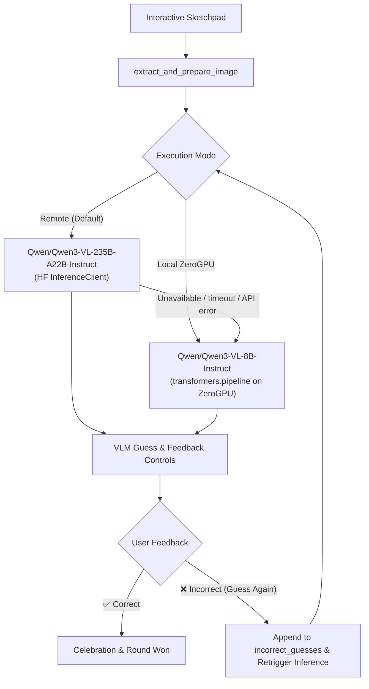

# VLM Guess the Drawing — Case Study 1

An interactive AI application hosted on [Hugging Face Spaces](https://huggingface.co/spaces/abugb/Case-Study-1) that challenges Vision-Language Models (VLMs) to identify drawings created on a digital sketchpad, featuring an interactive feedback loop with automatic retries when a guess is incorrect.

---

## Features

- **Interactive Canvas**: Draw any object or shape on the embedded Gradio sketchpad with a 10-color default palette and full custom color picker support.
- **Interactive Feedback & Retry Loop**:
  - Indicate whether the VLM's guess is **Correct** or **Incorrect**.
  - If marked incorrect, the VLM receives multi-turn conversational context with previous incorrect guesses excluded, prompting it to supply an alternate prediction.
  - Live guess history timeline displaying past attempts with strike-throughs and status tags.
- **Dual Execution Modes**:
  - **Remote Inference (Default)**: Uses Hugging Face's Inference API with `Qwen/Qwen3-VL-235B-A22B-Instruct`, automatically falling back to local generation on failure.
  - **Local ZeroGPU Inference**: Executes `Qwen/Qwen3-VL-8B-Instruct` directly on the Space's dynamic ZeroGPU hardware using `@spaces.GPU` and Hugging Face `transformers`. The existing checkbox still forces local execution.
- **Robust Preprocessing**: Automatically composites transparent strokes onto a clean white background and formats images for vision inference.
- **Automated CI/CD**: Seamless synchronization to Hugging Face Spaces with automated testing and Discord alerts.

---

## Architecture Overview



---

## Local Development

### Prerequisites
- Python 3.12+
- PyTorch with CUDA (optional, for local GPU execution)

### Installation
```bash
git clone https://github.com/abugb/Case-Study-1.git
cd Case-Study-1
pip install -r requirements.txt
```

### Running the Application
```bash
python app.py
```
Open [http://localhost:7860](http://localhost:7860) in your browser.

---

## Testing

The repository features comprehensive unit and end-to-end test suites:

### Fast Unit Tests (Offline / Mocked)
```bash
python -m pytest -v -m "not e2e"
```

### Live End-to-End Tests (Against Hugging Face Space)
```bash
export HF_TOKEN="your_huggingface_token"
python -m pytest -v tests/test_space_e2e.py
```

---

## CI/CD Workflow

- **`test.yml`**: Automatically runs unit tests on all pushes and pull requests to `main`.
- **`main.yml`**: Syncs code to the Hugging Face Space via `huggingface/hub-sync`, validates deployment with live E2E tests, and reports results to Discord.

## Automatic LLM Failover

With **Use Local Model** unchecked, every drawing request first tries the remote
model. The client has a 20-second timeout (`REMOTE_TIMEOUT_SECONDS` in `app.py`).
Missing `HF_TOKEN`, connection failures, timeouts, API exceptions (including HTTP
429 rate/usage limits and 503 outages), and empty responses trigger one local
attempt using the same drawing and incorrect-guess history. No checkbox change
is required. Every subsequent request tries remote again, so a successful remote
request automatically restores remote execution. There is no background probe
or retry loop. Checking the existing checkbox continues to force local execution.

The metrics area names the actual model and shows the automatic fallback reason.
If both attempts fail, it reports that no model succeeded and does not add the
error to guess history. The existing guess-only API stays compatible; Python
callers can use `return_metrics=True` to receive model identity and routing status.
Latency is generation time for the successful backend, not total fallback time.

### Reproducible Demonstration

Run the offline demonstration, which simulates backend responses without model
downloads, API charges, or a GPU:

```bash
python -m pytest -v -s tests/test_failover.py
```

For timeout, connection failure, HTTP 429, HTTP 503, and empty output, each test
prints a local result followed by a remote result after simulated recovery:

```text
429: Local -> A Bush
Recovered: Remote -> A Tree
```

The tests assert actual routing, timeout configuration, model labels, preserved
image/history, manual local behavior, and graceful failure of both backends.
These are mocked demonstrations, not evidence of live model availability.

For a live fallback demonstration, first ensure the local model loads on suitable
CUDA hardware (or the Space's GPU). Start the app without `HF_TOKEN`, leave the
checkbox unchecked, draw, and submit. The result should show **Model: Local** and
**Automatic fallback: HF_TOKEN not found**. Restart with a valid exported token
to exercise remote inference. For recovery without restarting, restore remote
connectivity after an outage and submit another request. The label returns to
**Model: Remote** when that call succeeds. An `.env` file alone is not loaded by
this app; set the environment variable in the launching shell or Space secrets.

### Advantages and Disadvantages

- **Advantages:** Requests can continue during remote outages or quota limits;
  switching needs no user action; model labels make routing visible; the drawing
  workflow, dependencies, and guess-only API remain unchanged.
- **Disadvantages:** The smaller local model may produce different or less accurate
  guesses and needs enough GPU memory plus downloaded weights. Fallback adds the
  failed remote wait to local generation time. Retrying remote on every request
  can repeatedly incur that delay or hit rate limits during a prolonged outage;
  a cooldown would help at larger scale. ZeroGPU may itself be unavailable or
  quota-limited, so fallback cannot guarantee success. Remote-first routing also
  means a drawing may already have been sent remotely before local fallback.
