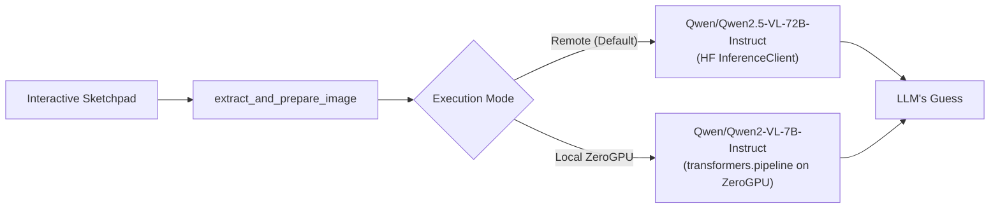

# LLM Guess the Drawing — Case Study 1

An interactive AI application hosted on [Hugging Face Spaces](https://huggingface.co/spaces/abugb/Case-Study-1) that challenges Vision-Language Models (VLMs) to identify drawings created on a digital sketchpad.

---

## Features

- **Interactive Canvas**: Draw any object or shape on the embedded Gradio sketchpad with a 10-color default palette and full custom color picker support.
- **Dual Execution Modes**:
  - **Remote Serverless Inference (Default)**: Leverages Hugging Face's serverless Inference API with `Qwen/Qwen2.5-VL-72B-Instruct` for zero-latency, high-accuracy guessing.
  - **Local ZeroGPU Inference**: Executes `Qwen/Qwen2-VL-7B-Instruct` directly on the Space's dynamic ZeroGPU hardware using `@spaces.GPU` and Hugging Face `transformers`.
- **Robust Preprocessing**: Automatically composites transparent strokes onto a clean white background and formats images for vision inference.
- **Automated CI/CD**: Seamless synchronization to Hugging Face Spaces with automated testing and Discord alerts.

---

## Architecture Overview



---

## Local Development

### Prerequisites
- Python 3.12+
- PyTorch with CUDA (optional, for local GPU execution)

### Installation
```bash
git clone https://github.com/abugb/Case-Study-1.git
cd Case-Study-1
pip install -r requirements.txt
```

### Running the Application
```bash
python app.py
```
Open [http://localhost:7860](http://localhost:7860) in your browser.

---

## Testing

The repository features comprehensive unit and end-to-end test suites:

### Fast Unit Tests (Offline / Mocked)
```bash
python -m pytest -v -m "not e2e"
```

### Live End-to-End Tests (Against Hugging Face Space)
```bash
export HF_TOKEN="your_huggingface_token"
python -m pytest -v tests/test_space_e2e.py
```

---

## CI/CD Workflow

- **`test.yml`**: Automatically runs unit tests on all pushes and pull requests to `main`.
- **`main.yml`**: Syncs code to the Hugging Face Space via `huggingface/hub-sync`, validates deployment with live E2E tests, and reports results to Discord.
